# Active Directory Lab/Project

In this lab, I demonstrate how to:  

- Apply real-world IT Helpdesk and System Administration skills, including **basic networking**  
- Deploy a Windows Server on AWS to manage IT resources for a demo company  
- Configure **TCP/IP** settings for the server  
- Set up **DNS** and **DHCP** services as part of the domain controller  
- Promote the server to a Domain Controller  
- Create and manage users and groups  
- Reset passwords and assign permissions  
- Enable Remote Desktop access to the virtual machine hosted on AWS

---

## Tech Stack

- AWS EC2 (Windows Server)  
- Windows Server  
- Active Directory Domain Services (AD DS)  
- Remote Desktop Protocol (RDP)  
- PowerShell (for automation)

---

## Step 1: Launch a Windows Server on AWS

- I launched an EC2 instance on AWS using the **Windows Server 2025** AMI as the operating system.  
  

- I then downloaded a `.pem` key pair to log into my EC2 instance.  
  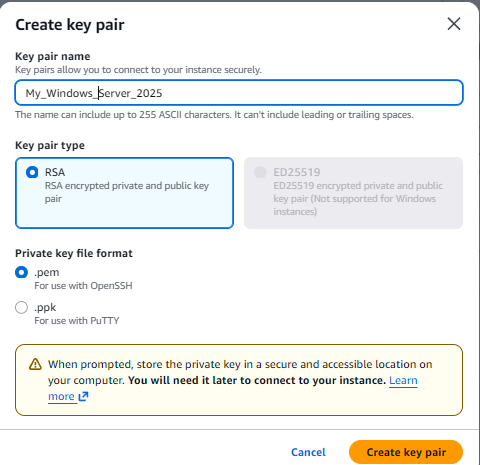

- I then created a **Security Group** to enable **RDP** access. I allowed inbound **TCP** traffic on **port 3389** from my **IP address** only.  
  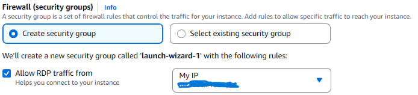

- I made sure to leave the **Auto-assign public IP** option enabled. This setting automatically allocates an IP address to your instance using AWS’s DHCP service.  
  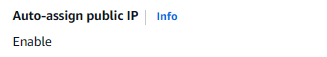

- AWS assigned a **public IP** to my instance via **DHCP** by default. I also experimented with attaching an **Elastic IP** to give the server a permanent address." 
    
  

- I ensured that my instance passed all status checks and was up and running.  
  

- AWS provided a public **DNS** link for my EC2 instance, which I used to connect without needing to remember the **IP**. 
  Example: `ec2-13-246-3-184.af-south-1.compute.amazonaws.com`  
  This identifies the server when connecting via RDP.  
  

- Now I’m ready to connect via RDP. I selected the EC2 instance and clicked **Connect**, then chose the **RDP client** option.  
  

- I uploaded the `.pem` key pair file to decrypt the Administrator password.  
    
  

- I downloaded the Remote Desktop file and double-clicked it to open.  
  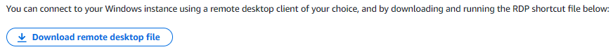

- When connecting to the server, Windows may display a warning about an unrecognized security certificate. EC2 instances use a self-signed certificate. Since I created the server, I proceeded to connect.  
  

- At this point, I have successfully connected to the instance via Remote Desktop (RDP).  
  

---

## Step 2: Installing Active Directory Domain Services (AD DS)

- I clicked **Start** and opened **Server Manager**. In **Server Manager**, I clicked **Add Roles and Features**.  
  

- Then I chose **Role-based or feature-based installation**.  
  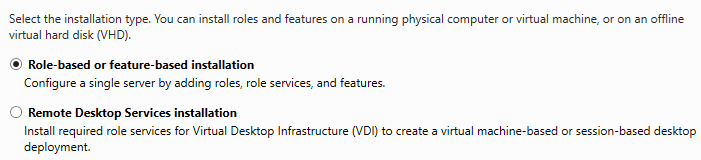

- I selected my EC2 instance from the server pool.  
  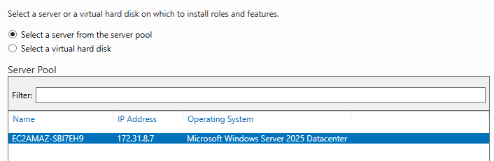

- I checked **Active Directory Domain Services** and clicked **Next** to install.  
  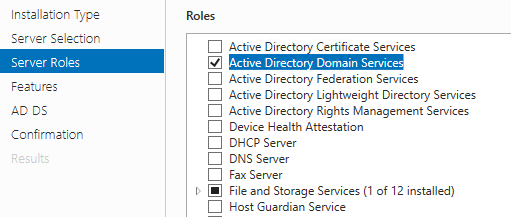

- I left the default features selected and proceeded with the installation. 
  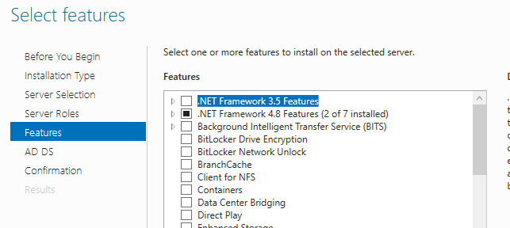

- I let the installation process complete.  
  

- After installation, a notification appeared to **Promote this server to a domain controller**.  
  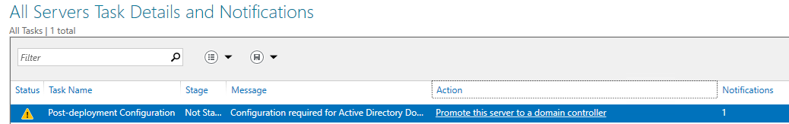

---

## Step 3: Promote Server to Domain Controller

- I clicked **Promote this server to a domain controller** from the notification in Server Manager.  

- I chose **Add a new forest** and entered my root domain name: `tebogo.lab`.  

- I set the **DSRM password** for Directory Services Restore Mode.  

- I ensured **DNS** and **Global Catalog** were enabled.  

- I clicked **Next** and then **Install**. The server restarted automatically.

- I also tested promotion using **PowerShell** to deploy the domain controller via command line.  
  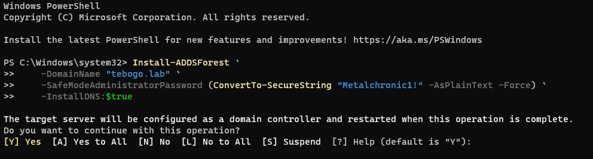

---

## Step 4: Create an Organizational Unit (OU)

- After the server restarted, I logged in as **Administrator**.  

- I opened **Active Directory Users and Computers**.  
  

- I right-clicked my domain (`tebogo.lab`) and selected **New → Organizational Unit**.  
  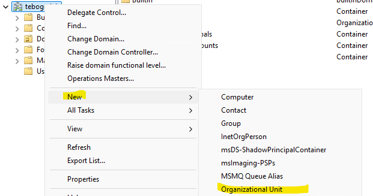

- I named the OU `TebogoLabUsers`.  
  

- I created this OU to organize the users and groups in my domain for easier management.

---

## Step 5: Creating Users

- I navigated to the OU `TebogoLabUsers` in **Active Directory Users and Computers**.  

- I right-clicked the OU and selected **New → User**.  
  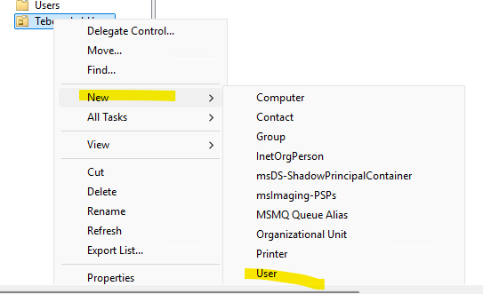

- I created a user called `John Doe` with the username `jdoe`.  
  

- I set an initial password and enabled **User must change password at next logon**.  
  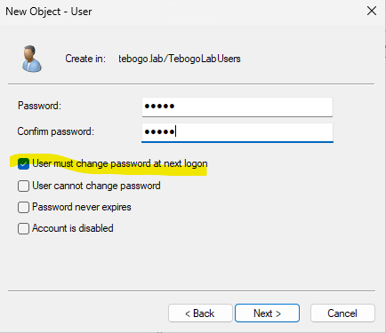

- I created additional users following the same steps.  
  

---

## Step 6: Creating Groups

- I navigated to the OU `TebogoLabUsers`.  

- I right-clicked the OU and selected **New → Group**.  

- I created a group called `HR`, set the scope to **Global**, and type to **Security**.  
  

- I added users to this group to assign permissions efficiently. For example, Jane Van Wyk was added to HR. Her membership is visible in **Properties → Member Of**.  
  

---

## Step 7: Assign Remote Desktop Permissions

- I navigated to each user in **Active Directory Users and Computers**.  

- I added users to the **Remote Desktop Users** group to allow RDP access. Otherwise, they could not log on.  
  

- Users can now log in to the AWS EC2 instance using Remote Desktop.

---

## Errors and Challenges

During this lab, I faced some challenges:

- **“Install” button greyed out for AD DS**  
  - Resolution: Ensured all required features and roles were selected, then clicked **Next** through the wizard to install.

- **DNS delegation warning**  
  - Resolution: I saw a DNS delegation warning after promoting the server. Since this is a new forest, I acknowledged it and continued.

- **Error creating user: name already in use**  
  - Resolution: Used unique usernames like `jdoe` to avoid duplicates.

- **Unable to log in via RDP with non-admin users**  
  - Resolution: Added users to the **Remote Desktop Users** group and updated Group Policy.

- **Password issues for new users**  
  - Resolution: Reset passwords and enabled **User must change password at next logon**.

- **Understanding AD terminology**  
  - Resolution: Studied terms like **forest**, **domain**, **NetBIOS name**, and **DSRM** and applied them correctly.

- **Automating AD DS deployment with PowerShell**  
  - Resolution: Used Windows-provided PowerShell script to deploy the domain controller automatically:  

```powershell
Import-Module ADDSDeployment

Install-ADDSForest `
    -CreateDnsDelegation:$false `
    -DatabasePath "C:\Windows\NTDS" `
    -DomainMode "Win2025" `
    -DomainName "tebogo.lab" `
    -DomainNetbiosName "TEBOGO" `
    -ForestMode "Win2025" `
    -InstallDns:$true `
    -LogPath "C:\Windows\NTDS" `
    -NoRebootOnCompletion:$false `
    -SysvolPath "C:\Windows\SYSVOL" `
    -Force:$true