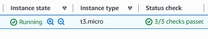
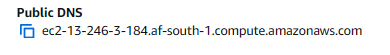

# Active Directory Lab/Project  

In this lab, I demonstrate how to:  
- Apply real-world IT Helpdesk and System Administration skills  
- Deploy a Windows Server on AWS to manage IT resources for a demo company  
- Promote the server to a Domain Controller  
- Create and manage users and groups  
- Reset passwords and assign permissions  
- Enable Remote Desktop access to the virtual machine hosted on AWS

## Tech Stack

- AWS EC2 (Windows Server)  
- Windows Server  
- Active Directory Domain Services (AD DS)  
- Remote Desktop Protocol (RDP)  
- PowerShell (for automation)

## Step 1: Launch a Windows Server on AWS

- I launched an EC2 instance on AWS using the **Windows Server 2025** AMI as the operating system.  

- I then downloaded a `.pem` key pair so that I could later connect via RDP (Remote Desktop Protocol).

- AWS then assigns an instance ID and a public IP address to your instance.  
  

- I then ensured that my instance passed all status checks and was up and running.  

- AWS provides a public DNS link for the EC2 instance. This allows you to connect without needing to remember the IP address.  
Example: `ec2-13-246-3-184.af-south-1.compute.amazonaws.com`  
This is used to identify the server when using your PC to connect via RDP.  

- Now you are ready to connect via RDP. Select the **RDP client** tab on your instance.  

 
- I uploaded the `.pem` key pair file to decrypt the Administrator password.  
  

- When connecting to your server, Windows may show a warning. This is because AWS uses a self-signed certificate instead of one from a big trusted authority.  
Since I created the server, it is safe to proceed and connect.  

- At this point, I have successfully connected to the instance via Remote Desktop (RDP).  
