# Active Directory Lab/Project  

In this lab, I demonstrate how to:  
- Apply real-world IT Helpdesk and System Administration skills, including **basic networking**  
- Deploy a Windows Server on AWS to manage IT resources for a demo company  
- Configure **TCP/IP** settings for the server  
- Set up **DNS** and **DHCP** services as part of the domain controller  
- Promote the server to a Domain Controller  
- Create and manage users and groups  
- Reset passwords and assign permissions  
- Enable Remote Desktop access to the virtual machine hosted on AWS

---

## Tech Stack

- AWS EC2 (Windows Server)  
- Windows Server  
- Active Directory Domain Services (AD DS)  
- Remote Desktop Protocol (RDP)  
- PowerShell (for automation)

---

## Step 1: Launch a Windows Server on AWS

- I launched an EC2 instance on AWS using the **Windows Server 2025** AMI as the operating system.  
  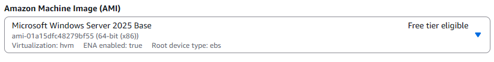

- I then downloaded a `.pem` key pair so that I could later connect via RDP (Remote Desktop Protocol).

- AWS then assigns an instance ID and a public IP address to your instance (**basic TCP/IP setup**)  
  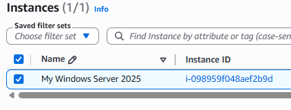  
  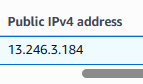

- The server can use DHCP or a static IP, demonstrating basic networking skills.

- I then ensured that my instance passed all status checks and was up and running.  
  

- AWS provides a public DNS link for the EC2 instance. This allows you to connect without needing to remember the IP address. (**DNS resolution for RDP access**)  
  Example: `ec2-13-246-3-184.af-south-1.compute.amazonaws.com`  
  This is used to identify the server when using your PC to connect via RDP.  
  

- Now you are ready to connect via RDP. Select the **RDP client** tab on your instance.  
  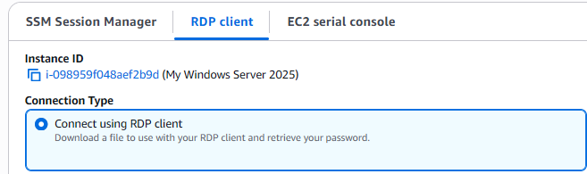
 
- I uploaded the `.pem` key pair file to decrypt the Administrator password.  
  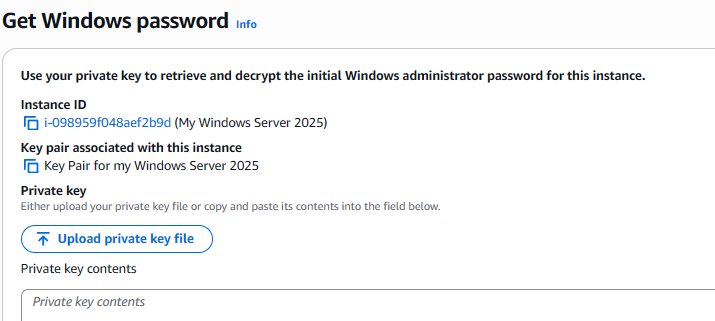  
  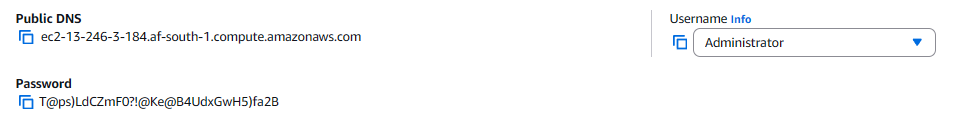

- When connecting to your server, Windows may show a warning. This is because AWS uses a self-signed certificate instead of one from a big trusted authority.  
  Since I created the server, it is safe to proceed and connect.  
  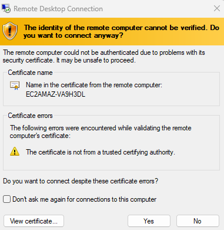

- At this point, I have successfully connected to the instance via Remote Desktop (RDP).  
  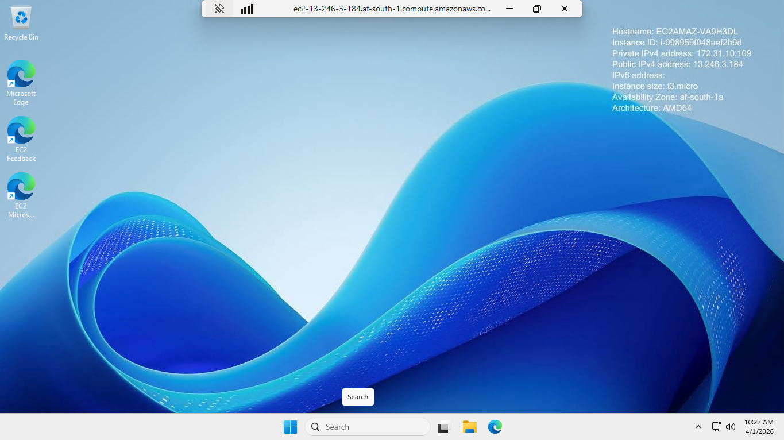

---

## Step 2: Installing Active Directory Domain Services (AD DS)

- In **Server Manager**, clicked **Add Roles and Features**.  
  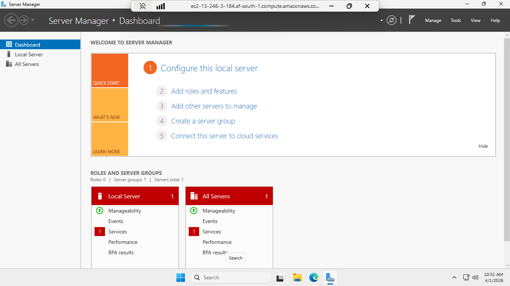
  
- Then I chose **Role-based or feature-based installation**. I then selected my EC2 instance from the server pool.  

- Then you check **Active Directory Domain Services** and click next to install.  
  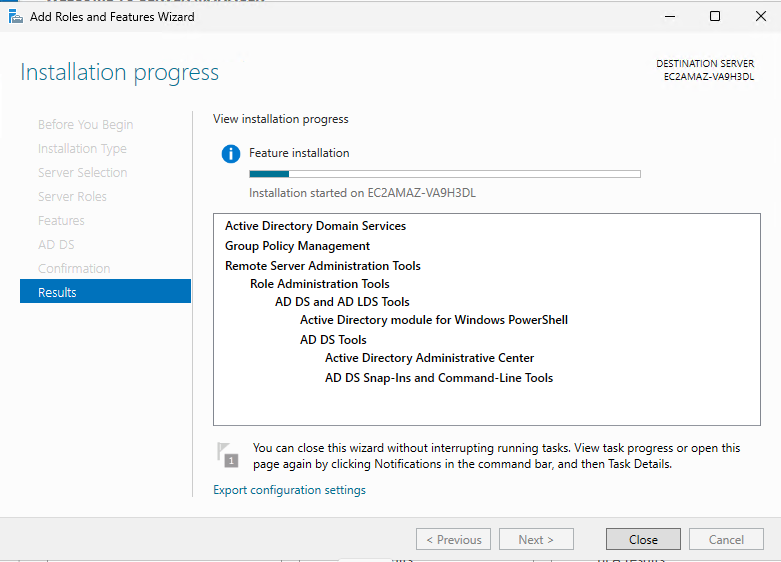  

- After installation, a notification appears to **Promote this server to a domain controller**.

---

## Step 3: Promote Server to Domain Controller

- I clicked **Promote this server to a domain controller** from the notification in Server Manager.  

- I chose **Add a new forest** and entered my root domain name. I called mine `tebogo.lab`.   

- I set the **DSRM password**. This is for when you use Directory Services Restore Mode.  

- I made sure **DNS** and **Global Catalog** were enabled.  

- I clicked **Next** and then **Install**. The server then restarted automatically.

---

## Step 4: Create an Organizational Unit (OU)

- After the server restarted, I logged in as **Administrator**. 

- I opened **Active Directory Users and Computers**.  
  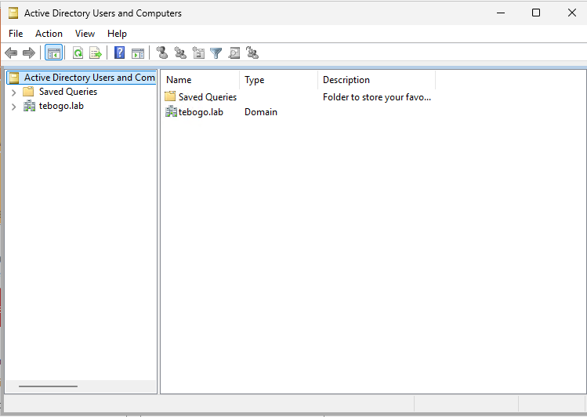  

- I right-clicked my domain (`tebogo.lab`) and selected **New → Organizational Unit**.  

- I named the OU `TebogoLabUsers`.  
  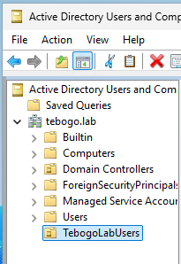  

- This OU will help me organize users and groups in the domain.

---

## Step 5: Creating Users

- I opened **Active Directory Users and Computers** and navigated to the OU `TebogoLabUsers`.  

- I right-clicked the OU and selected **New → User**.  

- I created a user called `John Doe` with the username `jdoe`.  
  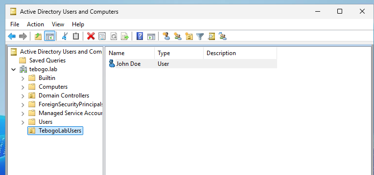

- I set an initial password and ensured **User must change password at next logon** was enabled.  

- I then created more users in this OU following the same steps.  
  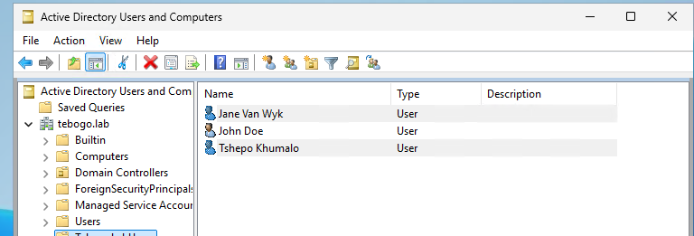

---

## Step 6: Creating Groups

- I opened **Active Directory Users and Computers** and navigated to the OU `TebogoLabUsers`.  

- I right-clicked the OU and selected **New → Group**.  

- I created a group called `HR` and set the group scope to **Global** and group type to **Security**.  
  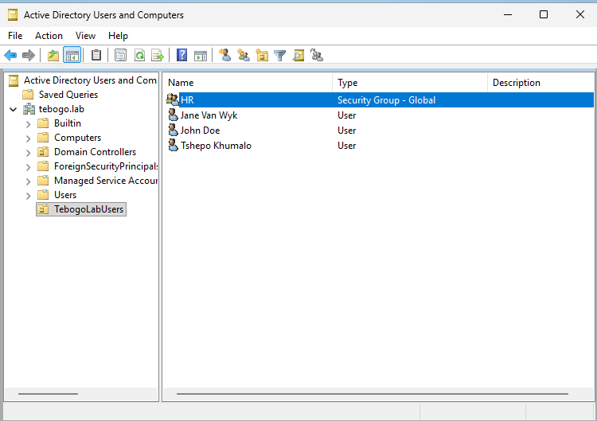  

- I can now add users to this group to assign permissions and access rights more efficiently. Here I added Jane Van Wyk to the HR group and you can see it in her **Properties → Member Of** tab.  
  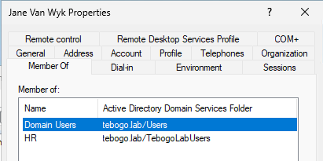

---

## Step 7: Assign Remote Desktop Permissions

- I navigated to each user in **Active Directory Users and Computers**.  

- I added the users individually to the **Remote Desktop Users** group so they could access the AWS EC2 instance via RDP. Otherwise they wouldn't be able to logon.  
  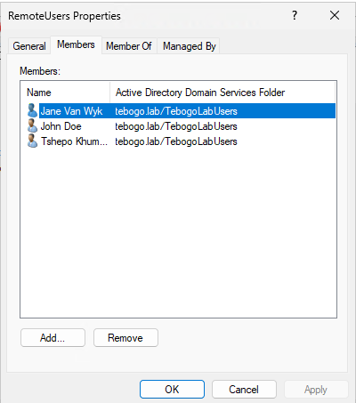  

- Now these users can log in to the AWS EC2 instance using Remote Desktop.

---

## Errors and Challenges

During this lab, I faced some challenges and documented how I overcame them:

- **“Install” button greyed out for AD DS**  
  - On the Confirmation page, the Install button was not clickable.  
  - **How I resolved it:** I made sure all required features and roles were selected, then clicked **Next** through the wizard until I managed to install.

- **DNS delegation warning**  
  - Message: *“A delegation for this DNS server cannot be created because the authoritative parent zone cannot be found…”*  
  - **How I resolved it:** Since this was a brand new forest and lab environment, no action was required. I acknowledged the warning and continued.

- **Error creating user: name already in use**  
  - This happened when I was trying to create a user called `Users` or duplicate usernames.  
  - **How I resolved it:** I used unique usernames like `John Doe` → `jdoe` and ensured there were no duplicates in AD.

- **Unable to log in via RDP with non-admin users**  
  - Error: *“The connection was denied because the user account is not authorized for remote login.”*  
  - **How I resolved it:** I added the users to the **Remote Desktop Users** group and updated Group Policy to allow remote login.

- **Password issues for new users**  
  - Some accounts could not log in initially due to password requirements.  
  - **How I resolved it:** I reset the passwords and made sure **User must change password at next logon** was enabled.

- **Understanding AD terminology**  
  - Terms like **forest**, **domain**, **NetBIOS name**, and **DSRM** were confusing at first.  
  - **How I resolved it:** I learnt each concept using AI and applied them correctly during setup.

- **Automating AD DS deployment with PowerShell**  
  - I wanted a quick way to deploy the domain controller without repeating all the steps in the GUI.  
  - **How I resolved it:** I used the PowerShell script that Windows provides after installation. It automatically sets up the domain, DNS, database, logs, and SYSVOL with the correct domain name, NetBIOS name, and forest/domain modes. This makes future deployments fast and repeatable. Here is the script:

Import-Module ADDSDeployment

Install-ADDSForest `
    -CreateDnsDelegation:$false `
    -DatabasePath "C:\Windows\NTDS" `
    -DomainMode "Win2025" `
    -DomainName "tebogo.lab" `
    -DomainNetbiosName "TEBOGO" `
    -ForestMode "Win2025" `
    -InstallDns:$true `
    -LogPath "C:\Windows\NTDS" `
    -NoRebootOnCompletion:$false `
    -SysvolPath "C:\Windows\SYSVOL" `
    -Force:$true

---

## Conclusion

This project demonstrates a complete workflow for **setting up a Windows Server on AWS**, **installing Active Directory Domain Services**, promoting the server to a **Domain Controller**, **creating an Organizational Unit**, **creating users and groups**,**assigning passwords** and assigning **Remote Desktop permissions**. It showcases practical IT Helpdesk and System Administration skills, along with basic networking knowledge such as **TCP/IP**, **DNS**, and **DHCP**.